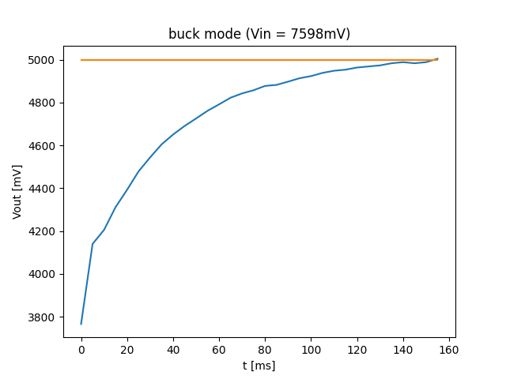
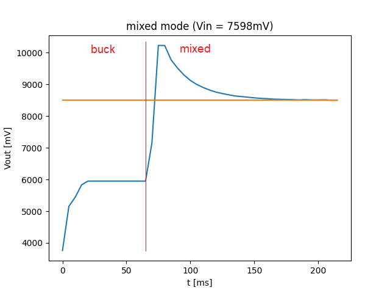
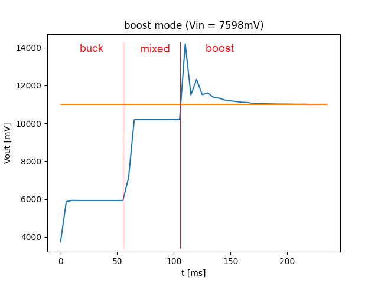

# stm32-dc-dc

This project contains the source code of an STM32F334C8T6 based DC-DC converter. The converter can operate in buck, boost and buck-boost (mixed) mode using high resolution timers (HRTIM) and is controlled by a PI controller. The input and output voltages are measured by ADC where the ADC trigger event is synchronized with the duty cycle: the voltages are measured before or after the PWM rising or falling edge (depending on the converter mode and duty cycle), this way the measurement noise can be minimalized.

The code has been implemented using STM32CubeIDE. For more information see the detailed documentation under the pull requests.

## Deployment

### Prerequisites

The following tools are necessary for building:
- `make`
- `arm-none-eabi-gcc`

### How to build

Invoke the following commands:

```bash
$ cd Debug
$ make all
```

which will build the _stm32f334c8t6.elf_ binary file (use your preferred method to download it, the SWD interface is configured so it can be used with an ST-LINK hardware).

Note: the SW can be built from STM32CubeIDE also (after importing the _.project_ and _.cproject_ files).

## Quickstart

The DC-DC control is currently disabled in _main.c_:

```c
void vDcDcTask(void const * argument)
{
  /* USER CODE BEGIN vDcDcTask */

    uint32_t ulThreadNotification;

    vSetDutyCycleBuck(5000u);
    vSetAdcTriggerPoint(2500u);

    HAL_HRTIM_WaveformOutputStart(&hhrtim1, HRTIM_OUTPUT_TA1 | HRTIM_OUTPUT_TA2 | HRTIM_OUTPUT_TB1 | HRTIM_OUTPUT_TB2);
    HAL_HRTIM_WaveformCountStart_IT(&hhrtim1, HRTIM_TIMERID_TIMER_A | HRTIM_TIMERID_TIMER_B);

    HAL_ADCEx_Calibration_Start(&hadc1, ADC_SINGLE_ENDED);
    HAL_ADCEx_InjectedStart_IT(&hadc1);

    for (;;)
    {
        ulThreadNotification = ulTaskNotifyTake(pdTRUE, portMAX_DELAY);

        if (ulThreadNotification)
        {
            ulVinRaw = HAL_ADCEx_InjectedGetValue(&hadc1, ADC_INJECTED_RANK_1);
            ulVoutRaw = HAL_ADCEx_InjectedGetValue(&hadc1, ADC_INJECTED_RANK_2);

            ulVinPhys = ulVinRawToPhys(ulVinRaw);
            ulVoutPhys = ulVoutRawToPhys(ulVoutRaw);

//            vDcDcControl(ulVoutPhys, 5000u);
        }
    }

  /* USER CODE END vDcDcTask */
}
```

Uncomment the control function and set the chosen output voltage in mV (for example 5000u = 5.00V), then the PI controller will set the desired value. The DC-DC task is activated every 5ms in the current configuration, so it can be made faster if necessary.

## Results

The following measurements illustrate the different working modes:







## License

This project contains files from multiple sources with different licenses. The relevant license is added to every source file.